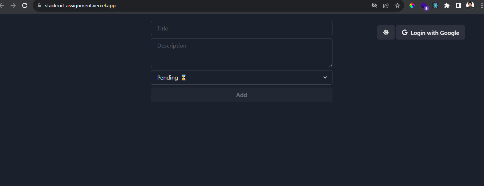
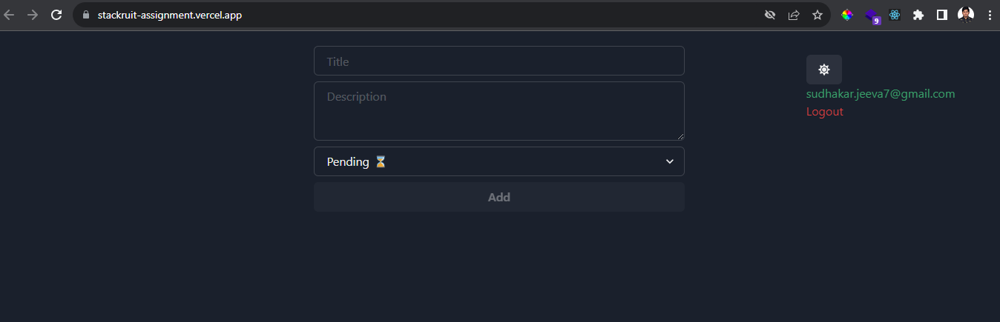
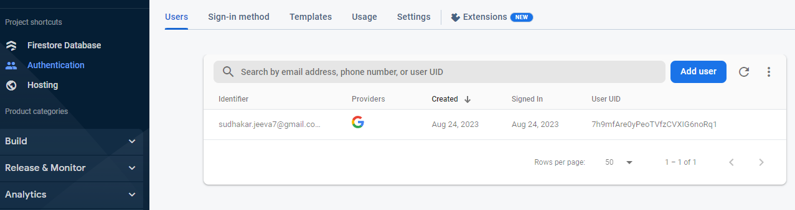
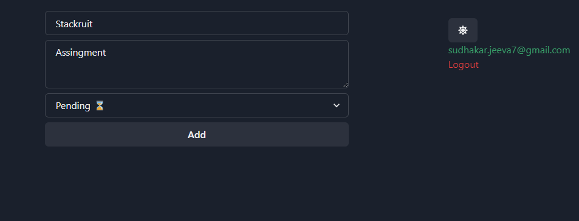
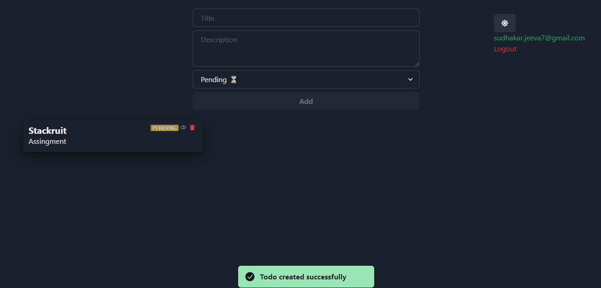
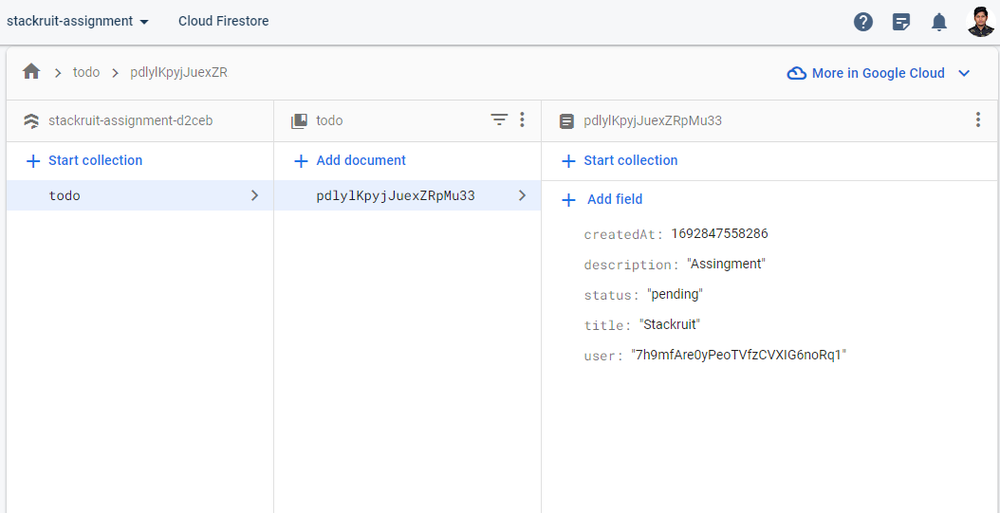
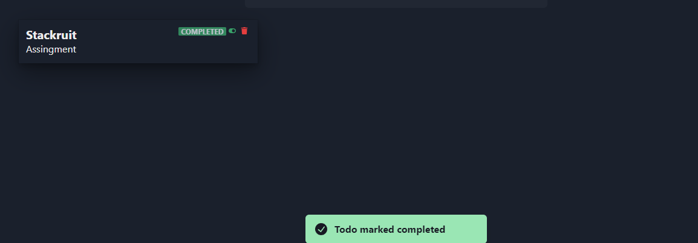
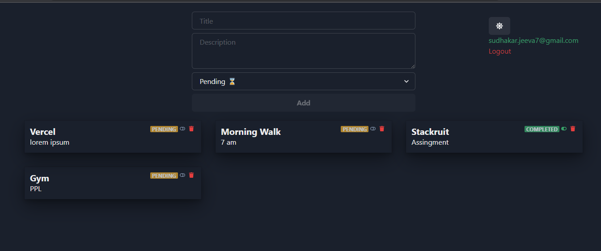
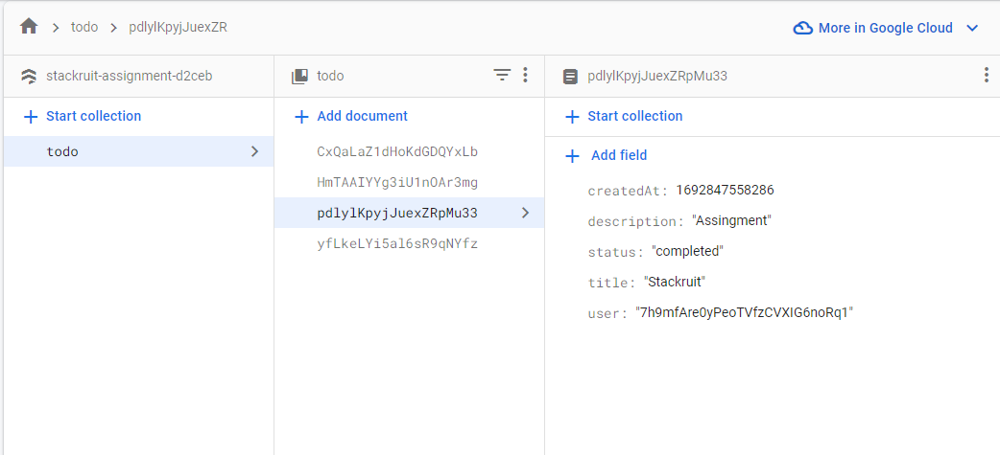

## Stackruit Assignment

### Replication steps

- open the terminal in the root of the project.
- run `npm install` to install all the dependencies for the project.
- then run the command `vercel` and it will auto build, deploy and give the hosted url.

### Note:

- incase of any build fails, you can run `npm run dev` to launch it locally.

### (optional) Currently deployed URL:

- You can directly go to the url and test it, since it is already deployed and ready.

` https://stackruit-assignment.vercel.app/`

### Techstacks used:

- NextJS, Firebase, TailwindCSS.

### Screenshots:

1. Landing page
   
2. On Logging with Google
   
   
3. Adding a task
   
   
4. Firestore db
   
5. Status change
   
6. Realtime DB updates reflected immediately on the UI
   
   
